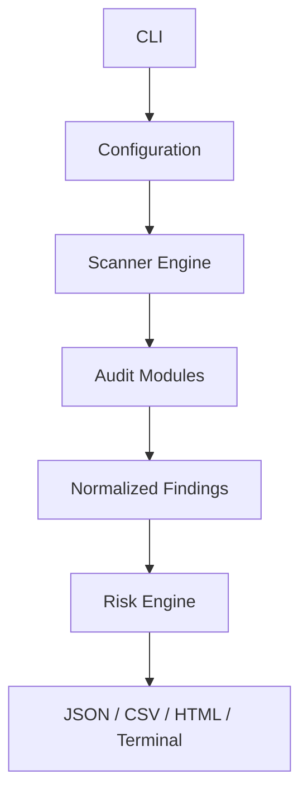

# infrastructure-security-scanner

A read-only, modular Python security auditing toolkit for Linux hosts, containers, and Kubernetes environments. It collects local evidence and normalizes results into findings for JSON, CSV, HTML, or terminal reports.

## Install

```bash
python3 -m venv .venv
. .venv/bin/activate
pip install -e .[dev]
```

## Usage

```bash
scanner --target localhost --format terminal
scanner --target localhost --format json --output reports/assessment.json
scanner --modules ssh_audit,filesystem_audit --format html --output reports/host.html
```

Nmap, Lynis, Trivy, Docker, Kubernetes, and firewall tools are optional. Missing tools produce an informational finding; the scan does not fail. The default operation is read-only and does not remediate systems.

## Architecture



## Risk model

Risk is a configurable combination of severity, exploitability, asset criticality, exposure, and confidence. It is deliberately not a CVSS score and should be interpreted alongside business context:

`risk = severity_weight * exploitability * asset_criticality * exposure * confidence * 10`

## Project layout

- `src/scanner/core`: configuration, finding schema, and orchestration
- `src/scanner/modules`: independent host and platform audits
- `src/scanner/reporters`: output formats
- `src/scanner/scoring`: risk calculation
- `tests`: unit coverage for every module and reporter
- `docs`: architecture, threat model, schema, and limitations

## Development

```bash
make test
make scan
```

Run only a focused audit with `--modules`. Review permissions before scanning production hosts, and store reports as sensitive security artifacts.
