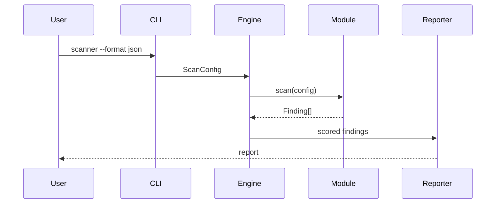

# Architecture

The CLI creates `ScanConfig`, passes it to `ScannerEngine`, and selects modules from the registry. Modules own collection and detection logic but share the `Finding` schema. The engine isolates module failures into low-severity scanner findings so one unavailable subsystem does not hide other results.

All external commands are executed with `subprocess.run` and a list of arguments. Integrations are optional and are never invoked through a shell.

